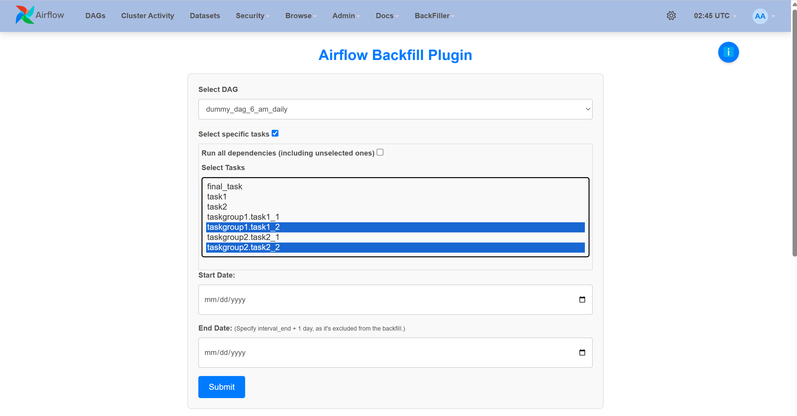
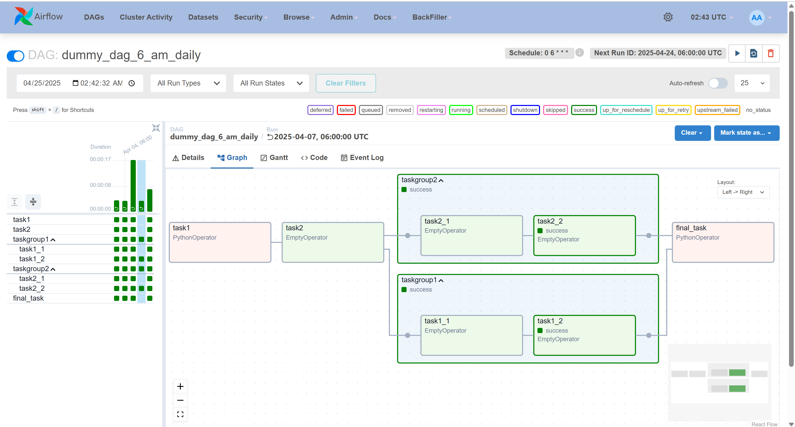

# Airflow Backfill Plugin
This plugin is a wrapper for airflow [backfill command](https://airflow.apache.org/docs/apache-airflow/2.10.2/cli-and-env-variables-ref.html#backfill) designed for backfilling unpaused scheduled DAGs on specific dates within Apache Airflow. 

## Usage

### Installing the Plugin

1. **Copy the Plugin**: Copy the `plugins/backfill_plugin` folder into the `plugins` folder of your Airflow instance.

2. **Using Docker**: If using `docker-compose.yaml`, make sure to include the plugin path in the volumes section.
3. **Restart Airflow**: After adding the plugin, restart both the Airflow webserver and scheduler for the changes to take effect.

### Initial Setup for Testing with Docker Compose

#### 1. Initialize AIRFLOW_UID and set permissions
Run the following commands to set up the environment, create necessary directories, and ensure correct file permissions:

```bash
echo -e "AIRFLOW_UID=$(id -u)" >> .env
mkdir -p .ignore plugins dags
sudo chown -R $USER:$USER .ignore plugins dags
```

### Starting airflow
```shell 
docker compose up -d
```

### Restarting webserver and scheduler
```shell 
docker compose stop airflow-webserver airflow-scheduler && docker compose up airflow-webserver airflow-scheduler -d
```


## Features
Simple UI with inputs for backfill dag selection with `start-date`, `end-date`, `tasks` and `ignore-dependencies`.

### Some screenshots:
Backfill home


Dag and task selection


Status log


Backfilled dag grid

